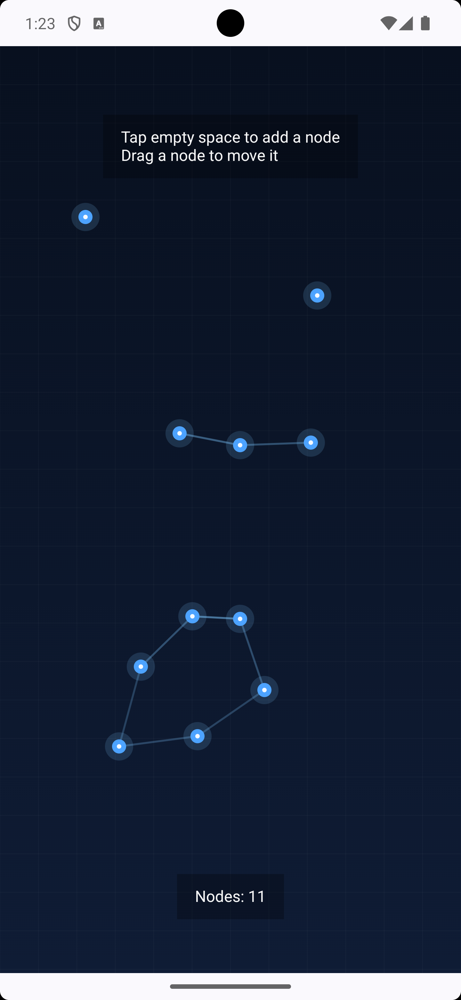

# Compose Canvas Demo

A focused Android sample demonstrating custom 2D rendering and interaction using Jetpack Compose Canvas.

## Features

- Tap empty space to add nodes
- Drag nodes to reposition them
- Dynamic line connections between nearby nodes
- Subtle grid background for spatial context
- State-driven rendering using Jetpack Compose

## Tech

- Kotlin
- Jetpack Compose
- Compose Canvas

## What this demonstrates

This sample showcases practical use of Android's drawing APIs and interaction handling:

- Custom rendering using Compose Canvas
- Pointer input handling (tap + drag gestures)
- Coordinate-based layout and distance calculations
- Dynamic UI updates driven by state
- Basic proximity-based graph visualization

## How it works (high-level)

- Each node is stored as a position on the canvas
- Tapping adds a new node at the touch location
- Dragging updates the node’s position in real time
- Connections are drawn between nodes within a defined distance threshold
- Rendering is fully driven by Compose state updates

## Why this sample

This is a deliberately minimal, single-screen demo focused on graphics and interaction.  
It is designed to highlight understanding of:

- Canvas-based rendering
- Gesture handling
- Real-time UI updates
- Visual feedback and interaction design

## Design Decisions & Tradeoffs

- I separated tap (node creation) from drag (node movement) to avoid gesture ambiguity and make interaction more intuitive.
- Connections are recalculated using pairwise distance checks on each redraw. This keeps the implementation simple for a small demo, though it would not scale well for large numbers of nodes.
- I clamp node positions to screen bounds so nodes remain fully visible during interaction.
- I used Compose Canvas directly to focus on rendering primitives, coordinate handling, and gesture-driven updates rather than higher-level abstractions.

## Limitations

- Connection calculation is O(n²), which is acceptable for this small sample but not ideal for larger datasets.
- The demo is intentionally single-screen and minimal, with no persistence or advanced animation system.

## Running the project

1. Clone the repository
2. Open in Android Studio
3. Run on an emulator or physical device

## Notes

- This is not a production app, but a focused technical sample
- No external libraries are used beyond Jetpack Compose
- Designed to be simple, readable, and easy to extend

## Preview
